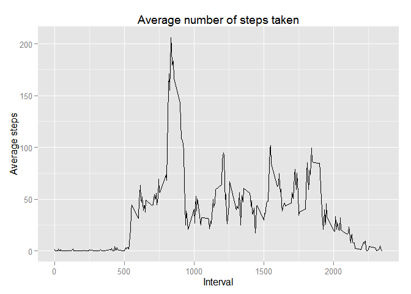

# Reproducible Research: Peer Assessment 1


## Loading and preprocessing the data

```r
unzip(zipfile="activity.zip")
activity <- read.csv("activity.csv")
```


## What is mean total number of steps taken per day?

```r
library(ggplot2)
total_steps <- tapply(activity$steps, activity$date, FUN=sum, na.rm=TRUE)
dtotal_steps <- data.frame(total_steps)
ggplot(data=dtotal_steps, aes(total_steps)) + geom_histogram(binwidth = 1000) + xlab("Steps") + ylab("Count") + labs(title="Total number of steps taken each day")
```

 


```r
meansteps <- format(mean(total_steps, na.rm=TRUE), nsmall = 2)
mediansteps <- format(median(total_steps, na.rm=TRUE), nsmall = 2)
```
The mean of the total number of steps taken per day is 9354.23.
The median of the total number of steps taken per day is 10395.


## What is the average daily activity pattern?

```r
library(ggplot2)
averages <- aggregate(x=list(steps=activity$steps),
                      by=list(interval=activity$interval), FUN=mean, na.rm=TRUE)
ggplot(data=averages, aes(x=interval, y=steps)) + geom_line() + 
        xlab("Interval") + ylab("Average steps") + labs(title="Average number of steps taken")
```

 


```r
maxave <- averages[which.max(averages$steps),]
```
On average across all the days, the 5-minute interval that contains the maximum number of steps is interval 835 with 206.1698 steps.


## Imputing missing values

There are a number of days/intervals where there are missing values (coded as `NA`). The presence of missing days may introduce bias into some calculations or summaries of the data.


```r
missing <- is.na(activity$steps)
total_missing <- sum(missing == TRUE)
```
Total number of missing values in the dataset is 2304.

Next is to create a new dataset containing the original dataset but with the missing values filled in with the mean value for that 5-minute interval.

```r
fill <- function(steps, interval) {
    filled <- NA
    if (!is.na(steps))
        filled <- c(steps)
    else
        filled <- (averages[averages$interval==interval, "steps"])
    return(filled)
}
filled_data <- activity
filled_data$steps <- mapply(fill, filled_data$steps, filled_data$interval)
```

Creating histogram of the new dataset.

```r
library(ggplot2)
total_steps2 <- tapply(filled_data$steps, filled_data$date, FUN=sum)
dtotal_steps2 <- data.frame(total_steps2)
ggplot(data=dtotal_steps2, aes(total_steps2)) + geom_histogram(binwidth = 1000) + xlab("Steps") + ylab("Count") + labs(title="Total number of steps taken each day")
```

 


```r
mean_totalsteps <- format(mean(total_steps2, na.rm=TRUE), nsmall = 2)
median_totalsteps <- format(median(total_steps2, na.rm=TRUE), nsmall = 2)
```
The mean of the total number of steps taken per day is 10766.19.
The median of the total number of steps taken per day is 10766.19.

The mean and median values are higher after imputing the missing data. The reason is that in the original data, there are some days with `steps` values `NA` for 
any `interval`. The total number of steps taken in such days are set to '0's by
default. However, after replacing missing `steps` values with the mean `steps`
of its associated `interval` value, these '0' values are removed from the histogram of the total number of steps taken each day.


## Are there differences in activity patterns between weekdays and weekends?

Let's begin by finding the day of the week for each data, whether it is a weekday or a weekend.

```r
dayofweek <- function(date) {
    day <- weekdays(date)
    if (day %in% c("Monday", "Tuesday", "Wednesday", "Thursday", "Friday"))
        return("weekday")
    else if (day %in% c("Saturday", "Sunday"))
        return("weekend")
    else
        stop("invalid date")
}
filled_data$date <- as.Date(filled_data$date)
filled_data$day <- sapply(filled_data$date, FUN=dayofweek)
```


```r
averages <- aggregate(steps ~ interval + day, data=filled_data, mean)
ggplot(averages, aes(interval, steps)) + geom_line() + facet_grid(day ~ .) +
    xlab("Interval") + ylab("Number of steps")
```

 

There are differences in activity patterns between weekdays and weekends.
